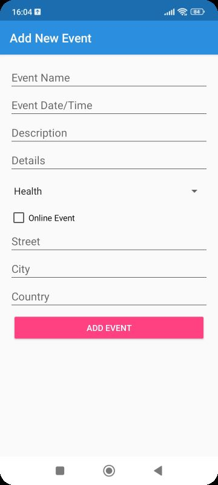

# Events Founder

Events Founder is an Android application designed to allow users to create, manage, and discover events worldwide. This project integrates with Firebase Firestore to provide real-time data storage and retrieval, enhancing the user experience with dynamic content updates.

## Introduction

Events Founder aims to connect people through various events, enabling users to explore activities they love or discover new passions. This application simplifies event management and discovery by offering robust features powered by modern technology. For more insights and the story behind this project, read our [blog post](#).

- **Landing page:** [https://malhaouit.github.io/](#)
- **Final project blog article:** [https://www.linkedin.com/feed/update/urn:li:activity:7206782815772835841/](#)
- **Author:** [https://www.linkedin.com/in/abdelmounaim-malhaoui/](#) (my LinkedIn profile)

## Features

- **Create Events:** Users can input detailed information about their events, including names, dates, times, descriptions, and locations.
- **Edit Events:** Modify details of existing events easily.
- **Delete Events:** Remove events no longer needed.
- **Event Categories:** Users can filter events by categories like Health, Sport, Food & Drink, Hobbies, and Business, facilitating easier navigation.
- **Real-time Updates:** Changes in the event details are updated instantaneously for all users.

<p align="center">
  
</p>

## Installation

1. Clone the repository:
   ```bash```
   git clone https://github.com/your-username/EventsFounder.git

2. Open the project in Android Studio.

3. Build the project and run it on an Android device or emulator.  

## Usage  

1. Creating an Event:

	- Click on the Add Event button.  
	- Fill in the event details and click Save.

2. Editing an Event:

	- Click on an event in the list to view details.  
	- Click the Edit button.  
	- Update the event details and click Save.   

3. Deleting an Event:

	- Click on an event in the list to view details.  
	- Click the Delete button.

## Contributing

Interested in contributing? Great! First, fork the repository. Make your changes and create a pull request. All contributions are appreciated!  

## Licensing

Events Founder is made available under the MIT License, which permits use, copy, modify, merge, publish, distribute, sublicense, and/or sell copies of the software, provided that the above copyright notice and this permission notice appear in all copies. This project is part of the educational curriculum of ALX.
